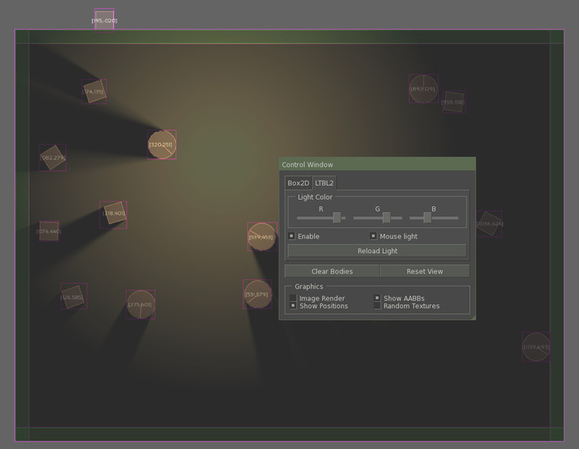

# SDL2D3
A project combining SFML Box2D LTBL2 SFGUI and EntityX.
The primary purpose of this project is an example of combining the libraries in a small sandbox.


==================


## Requirements
SFML and SFGUI are requred to be installed beforehand, while EntityX, Box2D and LTBL2 are included as submodules.
- SFML 2.2+ (http://www.sfml-dev.org/download.php)
- SFGUI 0.30+ (https://github.com/TankOs/SFGUI)

## Included Libraries
- EntityX (https://github.com/alecthomas/entityx)
- Box2D (https://github.com/erincatto/Box2D)
- LTBL2 (https://github.com/222464/LTBL2)

## Building and Running
Building requires GCC 4.9 or later, or any compiler with C++14 support. The `data` folder and `config.ini` (or .ini specified on ``argv[1]``) should be in the same directory as the built executable
```
cd SDL2D3/
git submodule init
git submodule update
mkdir build && cd build
cmake ..
make
```

This will build the executable SDL2D3 in the top-level directory.

## Controls
Control | Action
----------| ---------
Arrow Keys / WASD | Pan screen
Mouse wheel | Zoom screen 
Mouse wheel + CTRL |  Change light size
Left click  | Place box
Right click | Place circle
Middle click| Remove body at cursor
